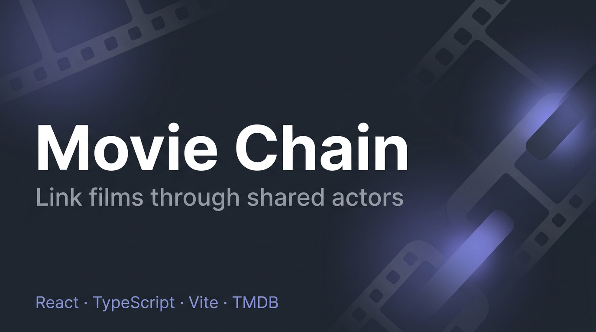

# Movie Chain App



A React learning project where movies are chained together through shared actors. Start with any movie, pick an actor from it, then pick one of their other movies — and keep going!

## Live Demo

The app is deployed and available at: **[https://zhannam85.github.io/movie-chain-react/](https://zhannam85.github.io/movie-chain-react/)**

## App at a Glance

- **Home (`/`)** — Pick a starting film (trending, search, or the daily challenge), then step through the chain: choose a connecting actor, then their next movie. Notes and chain state live here while you play.
- **Chain overview (`/chain`)** — Full read-friendly view of the current chain: bridge actors between films, per-link **challenge points** (difficulty scoring), and optional **logged dates** for each title (used for activity stats).
- **Stats (`/stats`)** — Local-only profile: activity heatmap, streaks, total challenge points, longest chain, top “bridge” actors, cast-frequency stats for films in the chain, and **achievements**.
- **About (`/about`)** — How the rules work and what powers the app (this mirrors the in-app About copy, including **English and Russian** UI via i18next).

Movie and actor detail pages (`/movie/:id`, `/actor/:id`) open full credits and filmography with sorting.

## Rules of the Chain

1. Pick a starting movie (from trending, search, or **today’s challenge** on the home screen).
2. Pick an actor from that movie’s cast.
3. Pick a movie from that actor’s filmography.
4. On the new movie, pick a **different** actor — not the one who just linked you here.
5. Repeat. You can also **prepend** an older film before the first movie in the chain (shared actor between the new film and the former “first” film).

## Stats & Gamification (all local)

Everything below is computed in the browser and stored with your chain (no account server):

- **Challenge points** — Each link after the first can score 0–21 based on movie popularity, vote counts, and how “famous” the connecting actor is (harder steps score higher).
- **Streaks & heatmap** — Consecutive days with logged activity and a calendar grid; you can set which calendar day counts for each link when adding or from the chain overview.
- **Achievements** — Milestones such as chain length, spanning decades, and first movie note.
- **Daily challenge** — A suggested start movie to try from; your best run length from that start is remembered locally.

## Tech Stack

- **React 19** + **TypeScript** + **Vite**
- **Tailwind CSS v4** (Vite plugin)
- **React Router v7** for navigation
- **i18next** / **react-i18next** — English (`en-US`) and Russian (`ru-RU`), with language persisted in `localStorage`
- **TMDB API** for movie and actor data, with **Kinopoisk unofficial API** as fallback when TMDB is unavailable (and optional manual preference via code / env; see `MovieApiContext`)
- **Vitest** + Testing Library for unit and component tests
- **localStorage** — Chain links, notes, gamification profile, language, API preference

## Getting Started

### 1. Get an API Key

**TMDB** (primary):

1. Sign up at [themoviedb.org](https://www.themoviedb.org/signup)
2. Go to [API settings](https://www.themoviedb.org/settings/api) and request an API key
3. Copy your API key (v3 auth)

**Kinopoisk** (optional fallback when TMDB is blocked, e.g. in some regions):

1. Register at [kinopoiskapiunofficial.tech](https://kinopoiskapiunofficial.tech)
2. Get your API token

### 2. Configure Environment

```bash
cp .env.example .env
```

Edit `.env` and set at least one of:

- `VITE_TMDB_API_KEY` — your TMDB API key
- `VITE_KINOPOISK_API_KEY` — your Kinopoisk API key (used automatically when TMDB fails)

### 3. Install and Run Application

```bash
npm install
npm run dev
```

The app will be available at `http://localhost:5173`.

### Tests

```bash
npm run test:run
```

## Project Structure (high level)

```
src/
  types/movie.ts              Shared TypeScript types (chain links, etc.)
  services/
    tmdb.ts, kinopoisk.ts     API clients
    tmdbMovieApi.ts           TMDB as MovieApi implementation
    movieApi.ts               Shared MovieApi interface
    movieApiClient.ts         Resolve TMDB vs Kinopoisk + caching
    apiResponseCache.ts       Request caching
  context/
    ChainContext.tsx          Chain state, gamification profile, persistence
    MovieApiContext.tsx       Active data source (TMDB / Kinopoisk)
  gamification/               Scoring, heatmap, streaks, achievements, daily challenge
  hooks/                      useChain, useMovieDetails, useActorDetails, bridge/title resolution, etc.
  components/                 UI: chain list, cards, pickers, heatmap, toasts, dialogs, …
  pages/
    HomePage.tsx              Start screen or interactive chain stepper
    ChainPage.tsx             Full chain overview (bridges, points, dates)
    UserStatsPage.tsx         Stats, heatmap, achievements
    AboutPage.tsx             Static about (i18n strings in i18n.ts)
    MovieDetailPage.tsx, ActorDetailPage.tsx
  i18n.ts                     Inline en-US / ru-RU strings
```

## Key React Concepts

This project exercises these React patterns (helpful for learning):

- **Functional components** with props and TypeScript
- **Hooks**: useState, useEffect, useCallback, useMemo, useContext
- **Custom hooks** for data fetching, chain state, and gamification side effects
- **Context API** for chain state and movie API selection
- **React Router** for client-side navigation
- **Internationalization** with react-i18next
- **Conditional rendering** and loading/error states
- **Controlled inputs** (search, comments, dates)
- **Lists with keys** and efficient rendering
